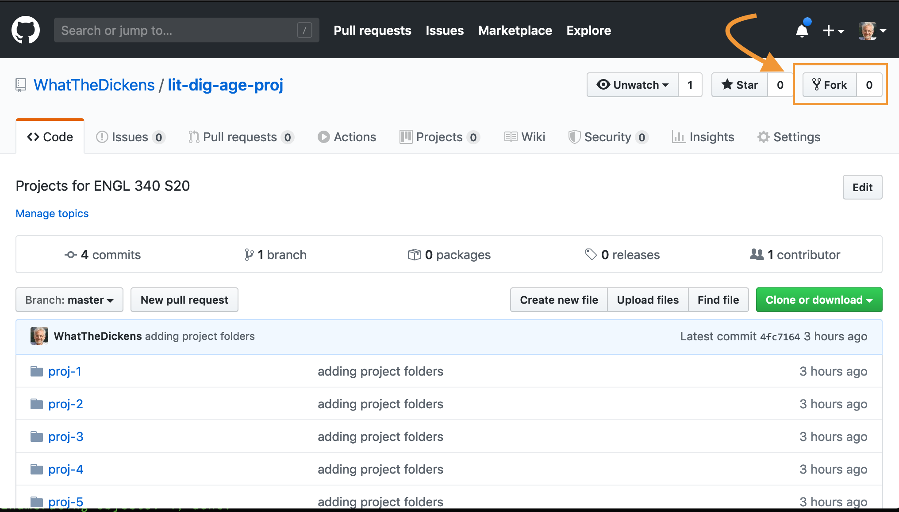
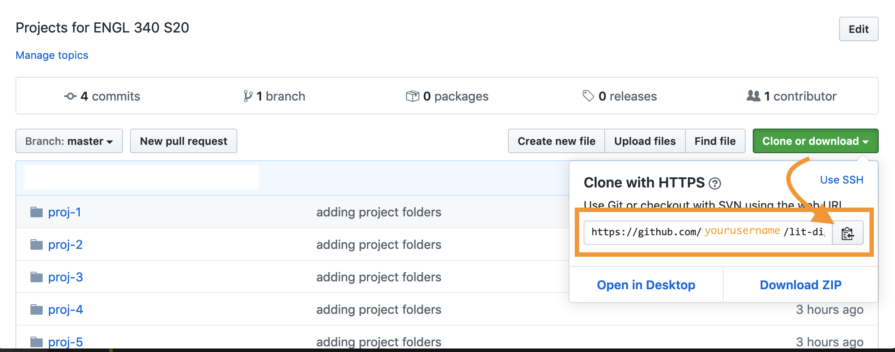

# How to use this repository for ENGL 340 S20

1. **Fork** this repository to your own account. (You only need to do this once.)
2. **Clone** *your forked repo* to your own machine. (You only need to do this once.)
3. **Sync** your fork with the *upstream* repository (this one). (Set up syncing once, sync before each time you go to make changes.)
3. On your own machine, **add or edit files** *in the folder for your project group*.
4. **Commit** your changes and push them to *your fork*.
5. **Open a pull request** to merge your changes upstream.

## Detailed instructions

### Fork

To **fork** this repository, just click the "fork" button at the top right of your browser window.

When you fork a repository, you create an exact copy of that repository in your own account.

. You'll be asked *where* you'd like to fork it. Fork it to your own GitHub account.

### Clone

To **clone** your forked repository, first, ***go to your own GitHub account*** and find the forked repository there. ***You don't want to clone the repository in my account but to clone the one in yours.***

When you clone a repository, you create an exact copy of a GitHub repository on your own machine, where you can work on it whether you're online or offline.  

Click the green "Clone or download" button and use the clipboard to copy the URL. The URL should contain your username, not mine.



Now open a terminal window and navigate to where you'd like to clone the repository. This could be `~/Documents` or any other convenient place. (Be sure to take note of where you cloned it so you can find your way back!) **Warning**: Don't clone it inside your journal repository. This is a separate repository.

At the command line, at the location where you'd like to put your clone, type `git clone` and paste the URL you copied at the end of the line. The result should look like this, with your actual username taking the place of `yourusername`

```
$ git clone https://github.com/yourusername/lit-dig-age-proj.git
```
Hit `Return` or `Enter`

### Sync

You'll now want to set your local copy of the repository (that is, your clone) to **sync** with the one on my account. That way, whenever changes are made to my account, you can update the copy on your machine, and the copy in your GitHub account on the web, to reflect the changes.

You only have to *set up* syncing once, but anytime you want to add to or edit the files in your local copy of the repository, you'll first want to *perform* a sync. That will ensure that you're not changing files that have been changed by someone else since the last time you worked on them.

#### Set up syncing

Head back to the `lit-dig-age-proj` repository in my account. That is, point your browser to <https://github.com/WhatTheDickens/lit-dig-age-proj>.

Use the green "Clone or download" button to copy the URL for *my* repository. (In the "clone" step above, you copied the URL of the clone in *your* repository.)

In the terminal, `cd` into the clone you created above, which should be named `lit-dig-age-proj`. Type the following `git remote -v` and press `Return` or `Enter`. You should see somethingh like this:

```
$ git remote -v
> origin  https://github.com/yourusername/lit-dig-age-proj.git (fetch)
> origin  https://github.com/yourusername/lit-dig-age-proj.git (push)
```
Now type `git remote add upstream`, and then paste the URL you copied from *my repository*. You should see this:

$ git remote add upstream https://github.com/WhatTheDickens/lit-dig-age-proj.git

press `Return` or `Enter`.

To verify the new upstream repository you've specified for your fork, type `git remote -v again`. You should see the URL for your fork as **origin**, and the URL for the original repository as **upstream**.

```
$ git remote -v
> origin  https://github.com/yourusername/lit-dig-age-proj.git (fetch)
> origin  https://github.com/yourusername/lit-dig-age-proj.git (push)
> upstream  https://github.com/WhatTheDickens/lit-dig-age-proj.git (fetch)
> upstream  https://github.com/WhatTheDickens/lit-dig-age-proj.git (push)
```
### Perform a sync

Here are the steps to perform a sync. Again, you'll want to do this whenever you return to your repository on your machine to add or edit files.

First, `cd` into the repository on your machine (`lit-dig-age-proj`).

Next, fetch the branches and their respective commits from the upstream repository. Commits to master will be stored in a local branch, upstream/master.

```
$ git fetch upstream
> remote: Counting objects: 75, done.
> remote: Compressing objects: 100% (53/53), done.
> remote: Total 62 (delta 27), reused 44 (delta 9)
> Unpacking objects: 100% (62/62), done.
> From https://github.com/ORIGINAL_OWNER/ORIGINAL_REPOSITORY
>  * [new branch]      master     -> upstream/master
```

Now check out your fork's local master branch.

```
$ git checkout master
> Switched to branch 'master'
```

Merge the changes from upstream/master into your local master branch. This brings your fork's master branch into sync with the upstream repository, without losing your local changes.

```
$ git merge upstream/master
> Updating a422352..5fdff0f
> Fast-forward
>  README                    |    9 -------
>  README.md                 |    7 ++++++
>  2 files changed, 7 insertions(+), 9 deletions(-)
>  delete mode 100644 README
>  create mode 100644 README.md
```

```
If your local branch didn't have any unique commits, Git will instead perform a "fast-forward":

$ git merge upstream/master
> Updating 34e91da..16c56ad
> Fast-forward
>  README.md                 |    5 +++--
>  1 file changed, 3 insertions(+), 2 deletions(-)
```

## Change — Commit — Pull request

You now have a repository in your GitHub account online named `lit-dig-age-proj` which you got by forking the repository in my account with the same name. And you have a copy of *your* repository sitting locally on your machine.

You know how to push changes you make on your machine up to your GitHub account. It's the same process you've been following with your journal files.

1. Make the changes on your machine
2. Add the changes with `git add` and the names of files you've changed
3. Commit the changes with `git commit -m 'some comment about your commit'`
4. Push the changes with `git push origin master`

But how do you get your changes into *my* repository at <https://github.com/WhatTheDickens/lit-dig-age-proj.git>? The answer is with a **pull request**. This is a request from you to me, asking me to pull your changes into my repository, the *upstream* repository for the project.

Here's how to do it.

In your own fork of the repository, click the "New pull request" button.


This should take you to the upstream repository, where you'll see an "Open a pull request" dialog. The dialog should reflect that you're looking for your changes to be merged from your repository (the "head") to the upstream repository (the "base"). You should see a green check mark and the message "Able to merge." In the comment box, you can leave a short message about your request. Scroll down and click the green "Create pull request" button to create the pull request.

That's it! Your request will kick a notification to me. I'll either approve your request, merging your changes into the repository in my account, or send you a message through GitHub that your file needs to be modified further in some way before it can be incorporated.